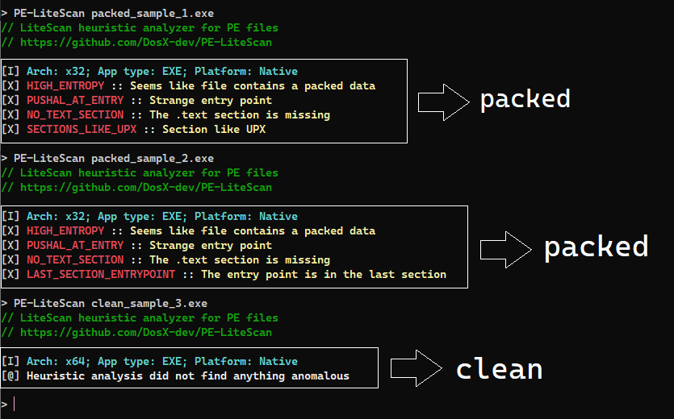

# PELS analyzer
**PE-LiteScan** (or **PELS**) is a simple heuristic analyzer for common PE-anomalies, specifically focusing on the detection of packers and protectors. Designed for Windows and Linux.

> **[Download for Windows/Linux x64](https://github.com/DosX-dev/PE-LiteScan/releases/tag/Builds)**



# Using
> **Windows**
> ```
> PE-LiteScan-windows.exe "file_to_check.exe"
> ```

> **Linux**
> ```
> ./PE-LiteScan-linux "file_to_check.exe"
> ```

# Detection types
| Detection Type              | Description                                                                 |
|-----------------------------|-----------------------------------------------------------------------------|
| `LAST_SECTION_ENTRYPOINT`   | The entry point is located in the last section of the file.                  |
| `NO_TEXT_SECTION`           | The `.text` section is missing from the PE file.                            |
| `STRANGE_OVERLAY`           | Compressed data found in the overlay section of the file.                   |
| `HIGH_ENTROPY`              | High entropy detected, indicating possible packed data.                     |
| `NET_ANTI_ILDASM`           | The `.NET` binary has the `SuppressIldasmAttribute` attribute.               |
| `PUSHAL_AT_ENTRY`           | Strange entry point detected (e.g., starts with `PUSHAL` instruction).      |
| `CUSTOM_DOS_STUB`           | Unusual DOS stub found in the PE file.                                       |
| `IMPORT_TABLE_MISSING`      | The import table is missing from the PE file.                                |
| `SECTIONS_LIKE_*`           | Section names match known packer signatures (e.g., `UPX`, `VMProtect`).     |

# To do
 * Sections name checking
 * Sections entropy checking
 * More signatures for .NET

> Powered by `PeNet` library.
